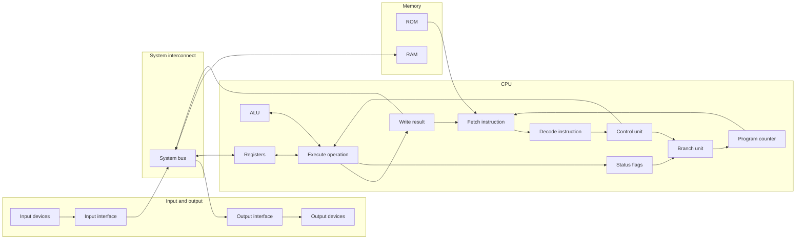
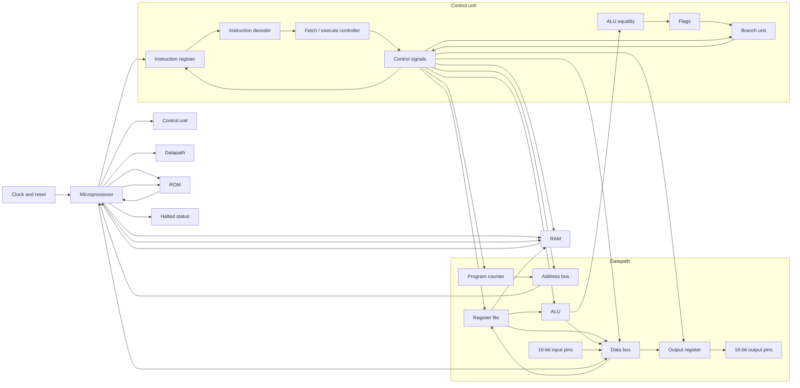
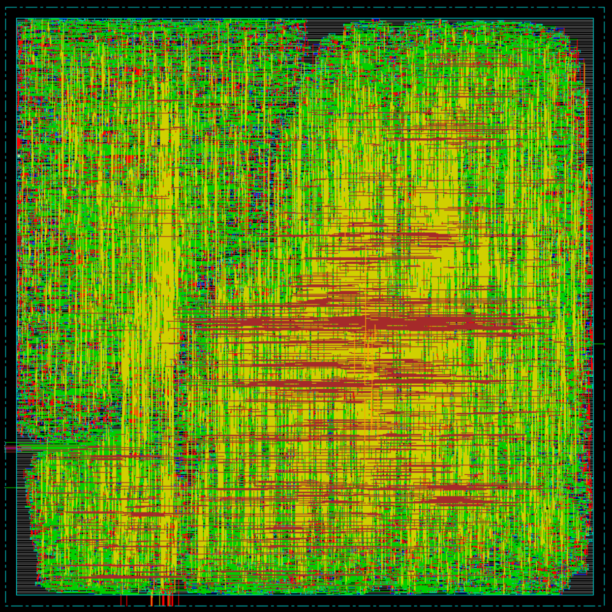

# silicon-operator

A small, non-pipelined 32-bit CPU built as an educational VLSI project.
It has 16 general-purpose registers, a 256-word instruction ROM, a 256-word data RAM,
and 16-bit input and output ports. Instructions are 32 bits wide, with an 8-bit opcode.

## Build results

The checked-in results are from Cadence Encounter using the GPDK045 slow corner at 1.08 V and 125 °C.

### Timing

Post-route setup analysis reports positive slack in every path group:

| Path group           | Worst slack |
| -------------------- | ----------: |
| Register to register |    1.007 ns |
| Input to register    |    7.447 ns |
| Register to output   |    8.519 ns |

Total negative slack is 0 ns, with no violating paths across 26,863 analyzed
setup paths. The synthesis report, before place and route, reports 4.099 ns
of timing slack on its critical path.

### Power

The post-route estimate is 25.55 mW total:

| Component |     Power |
| --------- | --------: |
| Internal  | 18.152 mW |
| Switching |  7.392 mW |
| Leakage   | 0.0052 mW |

Sequential cells account for 13.72 mW and combinational logic for 11.83 mW.
This is an estimate, not a measurement. The report has no user-defined
activity file and uses the tool's default primary-input activity.

### Physical design

| Metric             |        Result |
| ------------------ | ------------: |
| Placed cell area   | 126,874.1 µm² |
| Cell count         |        32,210 |
| Gate count         |       123,658 |
| Routed wire length |    906,067 µm |
| Vias               |       260,486 |
| DRC violations     |             0 |
| Routing failures   |             0 |

## Design diagrams

### CPU architecture



### RTL architecture



### CPU layout



### CPU Schematics


### Schematics of Some Important Modules

#### ALU


#### Datapath


#### Control unit


#### Instruction decoder


#### Registers


#### Bus


## Supported instructions

| Opcode | Instruction | Operation                           |
| ------ | ----------- | ----------------------------------- |
| `00`   | NOP         | No operation                        |
| `01`   | MOVI        | Sign-extended immediate to register |
| `02`   | MOV         | Copy register                       |
| `03`   | ADD         | Add registers                       |
| `04`   | SUB         | Subtract registers                  |
| `05`   | CMP         | Set zero flag if equal              |
| `06`   | LOAD        | RAM to register                     |
| `07`   | STORE       | Register to RAM                     |
| `08`   | JMP         | Absolute jump                       |
| `09`   | BEQ         | Branch if equal                     |
| `0A`   | BNE         | Branch if not equal                 |
| `0B`   | IN          | Input pins to register              |
| `0C`   | OUT         | Register to output pins             |
| `FF`   | HALT        | Stop execution                      |

## Build and inspect

Run these commands in the Cadence VM:

```sh
make test           # Run the RTL testbench
make build          # Test, synthesize, place and route, and generate reports
make view-sim       # Open the simulation waveform in SimVision
make view-schematic # Open the synthesized schematic in RTL Compiler
make view-layout    # Open the placed design in Encounter
make view-reports   # Read the combined build reports
make clean          # Remove generated files
```
